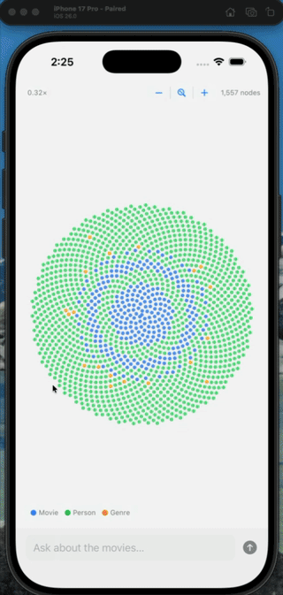

# KnowledgeGraphDemo — iOS Knowledge Graph Visualizer

An iOS app that renders a Neo4j movie knowledge graph as an interactive sunflower layout and lets you ask natural-language questions answered by an LLM pipeline.

---

## Demo

<!-- Replace the line below with your actual GIF once recorded -->
<!-- Tip: record with Xcode Simulator → File › Record Screen, then drop the .gif here -->



---

## Features

| Feature | Detail |
|---------|--------|
| **Phyllotaxis layout** | 1,500+ nodes arranged in a golden-angle spiral for uniform circular distribution |
| **Pan & pinch-to-zoom** | Explore any region of the graph; zoom 0.1×–8× |
| **Zoom controls** | Floating `−` / `⊙` (reset) / `+` buttons; zoom level badge always visible |
| **LLM query** | Type a natural-language question; results from a LangGraph retrieve → generate pipeline |
| **Spotlight highlighting** | Matched nodes enlarge, get a ring, and show their name; background dims |
| **Auto-pan to results** | Canvas animates to centre all highlighted nodes after each query |
| **Pulse animation** | Highlighted nodes pulse with a yellow ring (TimelineView, only active when needed) |
| **Tap for node info** | Tap any dot → card shows name, type badge, IMDb rating ★, release year |
| **Node-type legend** | Persistent colour key: Movie (blue) · Person (green) · Genre (orange) |
| **Light theme** | White/off-white canvas, dark labels, vibrant node colours |
| **Static after settle** | Layout loop stops on convergence — zero re-renders once the graph is stable |

---

## Architecture

```
KnowledgeGraphDemo/
├── KnowledgeGraphDemoApp.swift   # App entry point (no SwiftData)
├── ContentView.swift             # Root ZStack — canvas, overlays, controls
│
├── Models/
│   ├── GraphModels.swift         # GraphNode, GraphEdge, GraphData, QueryResponse, JSONValue
│   └── LayoutModels.swift        # PositionedNode (canvas position + velocity)
│
├── Networking/
│   └── GraphAPIClient.swift      # actor; URLSession calls → /graph and /query
│
├── Layout/
│   └── ForceDirectedLayout.swift # nonisolated Verlet simulation (small graphs only)
│
├── ViewModels/
│   └── GraphViewModel.swift      # @Observable @MainActor; phyllotaxis init, layout loop,
│                                 #   zoom/pan state, query, auto-pan to highlights
│
└── Views/
    ├── GraphCanvasView.swift     # Canvas rendering, pan/pinch gestures, tap-to-select
    ├── HighlightPulseLayer.swift # TimelineView pulse rings (conditional — off when idle)
    ├── QueryBarView.swift        # Text field + send button
    ├── AnswerPanelView.swift     # Slide-up LLM answer panel
    └── NodeInfoCard.swift        # Tap-selected node info card (name, type, rating, year)
```

### Data flow

```
loadGraph()  →  GET /graph  →  1,557 nodes placed in phyllotaxis spiral
                              Layout loop runs (background thread, ≤200 iterations)
                              Loop exits on convergence → Canvas goes static

submitQuery() → POST /query → highlighted_node_ids returned
                            → spotlight effect + auto-pan + pulse animation starts
```

---

## API Contract

The backend is a FastAPI server from the [KnowledgeGraph](https://github.com/badrinathvm/KnowledgeGraph) repo.

### `GET /graph`

```json
{
  "nodes": [
    {
      "id": "4:7f7a77f1-11f2-4e0f-9844-c34234fe7cca:5",
      "label": "Movie",
      "name": "Toy Story",
      "properties": {
        "title": "Toy Story",
        "released": "1995-11-22",
        "imdbRating": 8.3,
        "plot": "..."
      }
    }
  ],
  "edges": [
    { "id": "5:...:0", "source": "4:...:5", "target": "4:...:9", "type": "ACTED_IN" }
  ]
}
```

### `POST /query`

```json
// Request
{ "question": "Who directed Toy Story?" }

// Response
{
  "answer": "Toy Story was directed by John Lasseter...",
  "highlighted_node_ids": ["4:7f7a77f1-...:5", "4:..."]
}
```

Node IDs are Neo4j `elementId()` strings and are the single source of truth shared between backend and iOS.

### Backend architecture

```
KnowledgeGraph/
├── server.py          # FastAPI app — /graph and /query endpoints
├── database/          # Neo4j connection + moviePlots vector index
├── graph/             # LangGraph workflow orchestration
├── nodes/             # retrieve and generate node functions
├── llm/               # OpenAI LLM factory (GPT-4o)
├── models/            # Pydantic request/response schemas
├── prompts/           # ChatPromptTemplate definitions
└── state/             # LangGraph state schema
```

**Query pipeline:** question → OpenAI embedding → `moviePlots` vector search → Neo4j element ID resolution → GPT-4o generation → answer + highlighted node IDs

---

## Requirements

### iOS App
- Xcode 16+ (uses `PBXFileSystemSynchronizedRootGroup` — files auto-discovered, no manual registration needed)
- iOS 26 SDK / Swift 6
- No external Swift dependencies

### Backend ([KnowledgeGraph](https://github.com/badrinathvm/KnowledgeGraph))
- Python 3.12+
- [uv](https://docs.astral.sh/uv/) package manager
- Neo4j instance with the movie dataset + `moviePlots` vector index loaded
- OpenAI API key (for embeddings and GPT-4o generation)

---

## Setup

### 1. Clone the backend

```bash
git clone https://github.com/badrinathvm/KnowledgeGraph.git
cd KnowledgeGraph
```

### 2. Configure the environment

```bash
cp .env.example .env   # fill in the values below
```

```env
NEO4J_URI=bolt://localhost:7687
NEO4J_USERNAME=neo4j
NEO4J_PASSWORD=your_password
NEO4J_DATABASE=neo4j
OPENAI_API_KEY=sk-...
```

### 3. Install dependencies

```bash
uv sync
```

> Install `uv` first if needed: `curl -LsSf https://astral.sh/uv/install.sh | sh`

### 4. Start the FastAPI server

```bash
uv run uvicorn server:app --reload
# Running on http://localhost:8000
```

Verify:

```bash
curl http://localhost:8000/graph | python3 -m json.tool | head -40
```

### 5. Run the iOS app

Open `KnowledgeGraphDemo.xcodeproj` in Xcode, select the **iPhone Simulator** target, and press **⌘R**.

> **Note:** The iOS Simulator and the FastAPI server must both be running on the same machine. ATS exempts `localhost` connections by default, so no extra configuration is needed.

---

## Usage

| Action | Gesture / UI |
|--------|-------------|
| Pan the graph | Drag with one finger |
| Zoom in / out | Pinch, or tap `+` / `−` buttons |
| Reset to overview | Tap the `⊙` button |
| Identify a node | Tap any dot → info card appears at top |
| Dismiss info card | Tap the `✕` on the card, or tap elsewhere |
| Ask a question | Type in the query bar → tap send or press Return |
| Dismiss answer | Tap the `✕` on the answer panel (also resets zoom) |

---

## Node Colours

| Colour | Type |
|--------|------|
| Blue | Movie |
| Green | Person |
| Orange | Genre |

Highlighted nodes (query results) are enlarged, outlined with a dark ring, labelled, and pulse with a yellow animation ring.

---

## Layout Algorithm

For large graphs (>200 nodes) the app uses a **phyllotaxis spiral** (golden-angle layout):

```
angle(i) = i × π × (3 − √5)   ← golden angle ≈ 137.5°
radius(i) = k × √i             ← k = 14 px ring spacing
position(i) = center + radius(i) × (cos(angle(i)), sin(angle(i)))
```

This distributes all nodes uniformly inside a circle with no overlaps and no force simulation required — instant, deterministic, and static.

For small graphs (≤200 nodes) a **Verlet spring simulation** runs on a background thread and exits automatically when the maximum node velocity drops below 0.5 px/frame.

---

## Project Notes

- **No `add_files.rb` needed** — Xcode 16's `PBXFileSystemSynchronizedRootGroup` auto-includes every `.swift` file placed in `KnowledgeGraphDemo/`.
- **Zero continuous re-renders** — Canvas only redraws when `@Observable` properties change. `TimelineView` is active only in `HighlightPulseLayer` and only while there are highlighted nodes.
- **Thread safety** — Force layout runs in `Task.detached`; results are published back via `await MainActor.run`. All ViewModel state is `@MainActor`-isolated.
